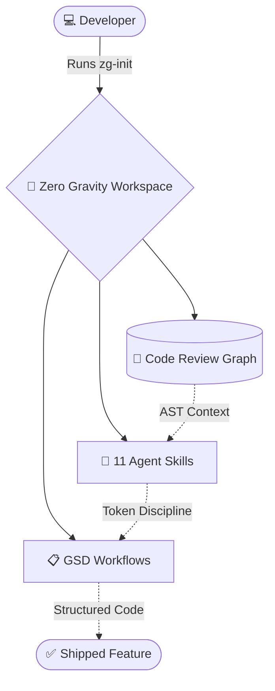
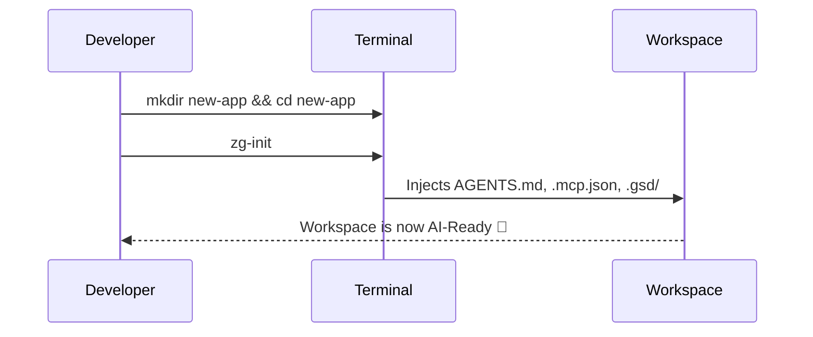

<div align="center">

# 🌌 ZERO GRAVITY DEV

**The Ultimate AI-Powered Development Environment.**

[](https://opensource.org/licenses/MIT)
[](https://www.python.org/)
[](https://github.com/Siddiqahmed26/zero-gravity-dev)

> *Clone → Setup → Build.* Your AI tools, agent skills, and project management — unified into one ultra-fast, portable workspace. Never configure an AI IDE from scratch again.

<br/>

**[ Cursor ]** &nbsp; · &nbsp; **[ Windsurf ]** &nbsp; · &nbsp; **[ Antigravity ]** &nbsp; · &nbsp; **[ VS Code ]**

<br/>

</div>

---

## 🚀 The Zero Gravity Architecture

Every time you start a new project or switch machines, you lose hours configuring AI behavior, MCP servers, and project tracking. **Zero Gravity Dev solves this by unifying three state-of-the-art open-source systems:**



### 1. 🔬 Code Review Graph (Your AI's Memory)
Builds a persistent AST knowledge graph of your entire codebase. Instead of burning context windows re-reading files, your AI *queries* the graph. Result: **6.8× fewer tokens** on reviews, up to **49× savings** on daily coding.

### 2. 📋 GSD Framework (Structured Execution)
Get Shit Done — a methodology that turns vague ideas into executable roadmaps. Every task has a spec, a plan, and proof of completion via **27 slash commands**.

### 3. 🧠 Agent Skills (Behavioral Overrides)
**11 pre-configured behaviors** that enforce context discipline, token budgeting, systematic debugging, and empirical validation. Active instantly, zero configuration.

---

## ⚡ 30-Second Global Installation

Run this **once** on your machine to install the core graph engine and terminal tools.

```bash
# 1. Clone the master workspace
git clone https://github.com/Siddiqahmed26/zero-gravity-dev.git
cd zero-gravity-dev

# 2. Run the automated installer
```
<details>
<summary><b>🪟 Windows Users</b> <i>(Click to expand)</i></summary>

```powershell
.\setup.ps1
```
</details>

<details>
<summary><b>🍎 macOS / 🐧 Linux Users</b> <i>(Click to expand)</i></summary>

```bash
chmod +x setup.sh && ./setup.sh
```
</details>

---

## 🌌 The `zg-init` Workflow

Once installed, you never need to clone this repository again. We've injected a permanent `zg-init` command into your system. 

Whenever you start a new project:



Open the folder in your IDE, and tell your AI: `/new-project`.

---

## 📈 Real-World Token Savings

Zero Gravity Dev is aggressively optimized to eliminate token waste and API costs.

| Scenario | Standard AI IDE | Zero Gravity | Net Reduction |
|:---------|:----------------|:-------------|:--------------|
| **Code review (10 files)** | ~50,000 tokens | ~5,000 tokens | <kbd>🟢 90%</kbd> |
| **Context: `auth.ts` (500 loc)** | ~2,000 tokens | ~100 tokens | <kbd>🟢 95%</kbd> |
| **Find all callers of function** | ~10,000 tokens | ~300 tokens | <kbd>🟢 97%</kbd> |
| **Systematic Debug Session** | ~30,000 tokens | ~8,000 tokens | <kbd>🟢 73%</kbd> |

---

## 🛠️ Advanced Tooling Reference

<details>
<summary><b>🧠 View All 11 Agent Skills</b></summary>

These instructions are baked into `AGENTS.md` and activate automatically to shape how your AI thinks and executes.

* **🗺️ Codebase Mapper:** Analyzes your project's structure before writing code.
* **🗜️ Context Compressor:** Summarizes files and references summaries instead of re-reading full files.
* **🔍 Context Fetch:** Search-before-read protocol. Greps for snippets before loading massive files.
* **📊 Context Health Monitor:** Triggers automatic state dumps before context degradation.
* **🐛 Debugger:** Systematic debugging tracking hypotheses and eliminated causes.
* **✅ Empirical Validation:** Requires test output/screenshots before marking tasks complete.
* **⚙️ Executor:** Follows GSD plans with atomic commits and checkpoint protocols.
* **🔎 Plan Checker:** Validates plans *before* execution to catch scope issues early.
* **📐 Planner:** Creates phase plans with dependency graphs and goal-backward verification.
* **💲 Token Budget:** Estimates token cost of plans before execution.
* **🏁 Verifier:** Validates completed work against the original specification.

</details>

<details>
<summary><b>💻 View All GSD Slash Commands</b></summary>

Type these to your AI inside any initialized workspace:

**🏗️ Setup & Planning**
* `/new-project` - Full guided project setup
* `/plan` - Decompose requirements into executable phases
* `/research-phase` - Deep-dive research before committing

**⚙️ Execution & Verification**
* `/execute` - Execute a phase with focused context
* `/sprint` - Rapid execution mode
* `/verify` - Validate work with empirical evidence
* `/audit-milestone` - Check a milestone for completeness

**🐛 Operations**
* `/debug` - Systematic debugging with persistent state
* `/progress` - Show current position in roadmap
* `/pause` - Save full AI state for later
* `/resume` - Restore context from previous session
* `/help` - Show all 27 available commands

</details>

---

## 🌐 Open Source Attribution

This master environment orchestrates two phenomenal open-source projects:

* **[Code Review Graph](https://github.com/tirth8205/code-review-graph):** Created by [@tirth8205](https://github.com/tirth8205) and 42 contributors. (MIT License).
* **[Get Shit Done (GSD)](https://github.com/toonight/get-shit-done-for-antigravity):** Created by [@toonight](https://github.com/toonight). (MIT License).

<br/>

<div align="center">

**Built with ❤️ for the Global Developer Community.** <br/>
*Stop configuring. Start building.*

</div>
